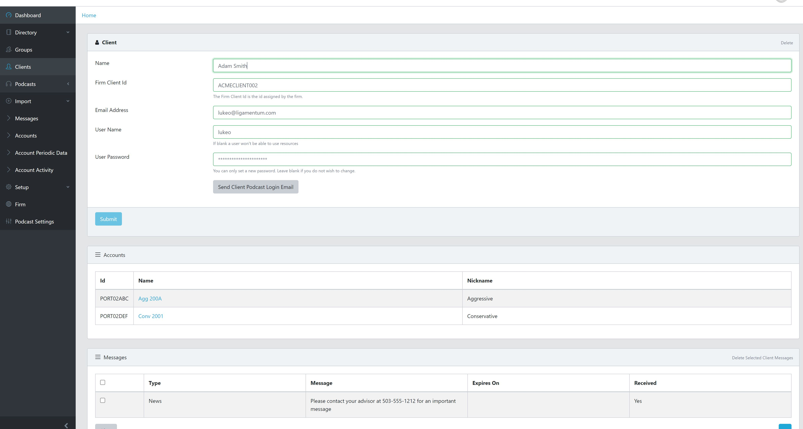

This is a proof of concept solution for a way to deliver financial information to clients that may be visually impaired via standard podcast formats. It supports both cloud based text to speech (TTS) and WAV file recordings.

Financial information would show up in the client's podcast application like any other podcast. An example of this on an iPhone is shown below.

 
 

Client management was done via a cloud based web interface using React

